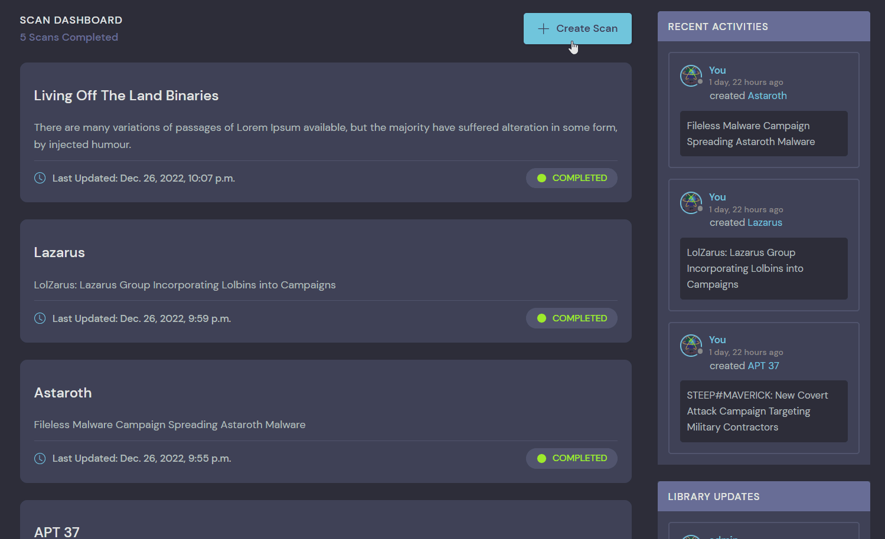
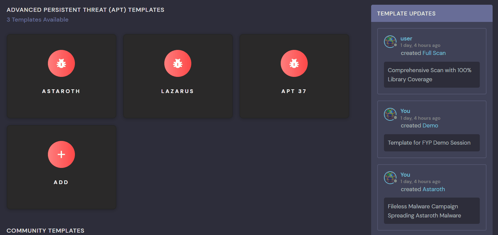
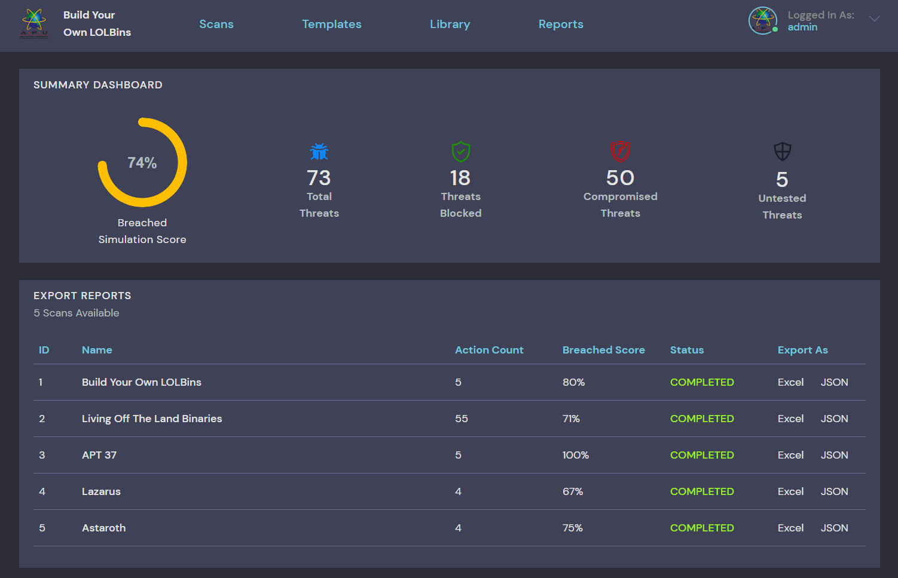

# Documentation
This documentation outlines all the basic tutorials for getting started with Build Your Own LOLBins (BYOL).

## Table of Contents
- [Getting Started](#Getting-Started)
- [Scan](#Scan)
    - [Creating Scan](#Creating-Scan)
        + [Adding Simulation](#Adding-Simulation)
        + [Editing Simulation](#Editing-Simulation)
    + [Launching Scan](#Launching-Scan)
    + [Terminating Scan](#Terminating-Scan)
- [Template](#Template)
    - [Cloning Scan](#Cloning-Scan)
    - [Mobilizing Template](#Mobilizing-Template)
- [Library](#Library)
    - [Adding Technique](#Adding-Technique-Admin)
    - [Adding Variant](#Adding-Variant-Admin)
    - [Adding Globfuscation](#Adding-Globfuscation-Admin)
- [Report](#Report)
- [Summary](#Summary)
- [Admin Management](#Admin-Management)
    - [Adding ATT&CK TTPs](#Adding-ATTCK-TTPs-Admin)

## Getting Started
To access the portal, use one of the following user accounts when prompted for login. The `admin` user has been granted privileged rights for [Admin Management](#Admin%20Management), and contains several scan history for ease of access. To build a scan from scratch, use the `user` account instead.

| Username | Password | Role          |
|:--------:|:--------:|:-------------:|
| admin    | admin    | Administrator |
| user     | user     | Default User  |

## Scan
All created and completed scans can be found in the **Scan Dashboard** under the **Scan** tab. Scans are sorted in descending order based on the latest update time. Every scan can have multiple simulations, and within each simulations are several layers of techniques/variants/objectives chained together.

### Creating Scan
1. On the Scan Dashboard, click on 
2. Enter details for the Windows 10 target machine:
    * **IP Address**: Ensure that the target machine has Internet connection to download payloads from the repo.
    * **Username**: Use a Local Administrator account to enable Interactive Logon session. 
    * **Password**: User credentials for authentication.
3. Select 



### Adding Simulation
1. On the bottom of an existing scan, click on 
2. Modify the newly added simulation by clicking the 🖊 button:
    * **Simulation Name**: Provide a new simulation name.
    * **Add Attacker Objective**: Select a technique from the library.
3. Select 


### Editing Simulation
1. Expand the offcanvas by clicking on the objective box.
2. Modify the technique by clicking the 🖊 button beside of **SIMULATION DETAILS**:
    * **Payload**: Main payload for threat simulation. Please include `.exe` as the extension for LOLBins for globufscation to work.
    * (Optional) **Cleanup**: Command to wipe leftover artificats. Also used as verification to lower false positive rate. Optional but highly encouraged to include. 
    * (Optional) **Chain To Previous**: When enabled, the current technique will execute if the previous one succedeed. Disabled by default, only enable if the payload has dependencies from the previous technique.
    * (Optional) **High Integrity Process**: Run the payload under High Integrity context. Disabled by default, only enable for privileged actions such as Credentials Dumping and Process Injection.
3. Select 


### Launching Scan
1. The current status must be one of the following for a scan to initiate:
    * **STOPPED**: Scanning is halted and results for all simulations are reset to NULL.
    * **COMPLETED**: Scanning is completed and results are displayed on the objective box.
    * **ERROR**: Scanning halted due to ConnectionError, TimeoutError or CredentialsError.
2. To start the scan, click on the status display-bar located on the top-right corner.

### Terminating Scan
1. To terminate a scan in-progress, the status must be **RUNNING**:
    * **RUNNING**: Scanning in progress, results are updated in real-time. Refresh required.
2. Click on the status display-bar located on the top-right corner, and the scan will be halted automatically on the next interval.


## Template
Scan templates are granular configuration settings specified by the user. It is essentially a snapshot of all the simulations and techniques contained in a scan at the time of cloning. This allows user to replicate scans easily and make changes to existing scans without compromising the original backup.

### Template Types
There are mainly 3 types of Scan Templates:
* **APT**: Specialized templates that simulates the attack chain of Advanced Persistent Threat (APT) groups. Accessible by everyone, but only Administrators can create or modify such template.
* **Community**: Public templates that are shared among all users. Accessible by everyone and can be published by anyone, but only the template owner has Edit permission.
* **Private**: Private templates that are only accessible by the owner. Acts as a backup for scans.

### Cloning Scan
1. On the **Templates** tab, select one of the template types and click **ADD**.
2. Select one of the existing scans to clone from.
3. Click 



### Mobilizing Template
1. On the top right of a template, click on 
2. Enter details for the newly created scan.
3. Select 

## Library
The threat library consisting of **24 Unique LOLBins** and **49 Variants** is accessible publicly for browsing, but can only be modified by an Administrator. The built-in search bar allows user to query techniques based on attributes like **Binary Name**, **Objectives** and **APT Groups**.

### Adding Technique \[Admin]
1. On the **Library** tab, click on 
2. Enter details for the new technique/binary, these attributes will affect how the technique appear in the search bar:
    * **Objectives**: Select one or more than one execution purpose.
    * **(Optional) APT Groups**: Select any APT groups based on the prevelance of usage and adoption.
3. Select 

### Adding Variant \[Admin]
1. On the **Library** tab, click on the **Technique Name** of any binary to view the variant details.
2. To add a new variant, click on 
3. Enter details for the new variant. Some attributes must first be created in [Admin Management](#Admin%20Management) before it can be selected here:
    * **Severity**: Threat level of the variant. Available options are: **HIGH**, **MEDIUM** & **LOW**.
    * **ATT&CK Sub-Technique**: Sub-techniques are automatically mapped to it's Parent Technique and Tactic.
    * **Objective**: Select one execution purpose.
    * **Generic Payload**: Generic Payload only acts as a reference to improve payload customization, and will not be executed in any occasion. Command arguments are denoted with the format `#{arg}`.
    * **Default Payload**: The primary payload that will be referenced when a variant is added to a simulation or scan. It is a mirror to the Generic Payload, but with the command arguments substituted with actual process name or file name. All default payloads are non-malicious and will only execute `calc.exe` as a Proof-of-Concept.  
    * **Generic Cleanup**: Cleanup command with interchangable placeholder `#{arg}` to act as a guidance for payload customization.
    * **Default Cleanup**: The primary cleanup command that is executed at the end of every test cases. Common cleanup operations involves deleting a file or killing a process.
    * **Description**: Variant description for user reading purposes.
    * **Detection Guide**: Detection strategy based on MITRE ATT&CK Framework.
    * **Prevention Guide**: Mitigation strategy based on MITRE ATT&CK Framework.
    * **MITRE ATT&CK**: Reference link to MITRE ATT&CK Framework.
    * **LOLBAS Project**: Reference link to LOLBAS Project.
4. Select 

### Adding Globfuscation \[Admin]
Due to the time complexity associated, finding all the matching wildcards (Globfuscation) of a LOLBin cannot be performed on runtime and must be done seperately in advanced on a Windows Machine with Python 3.11.X installed using [globfuscation.py](./globfuscation.py).
```
python .\globfuscation.py "C:\\Windows\\System32\\calc.exe"
```

## Report
BYOL provides the option to export scan results in 2 formats: **Excel** and **JSON**. 

**NOTE:** The Excel file downloaded may be blocked by certain Web Browsers or Antivirus vendors, because it contains actual payload used in the simulations. This is in fact false positive, and rest assure that it is not a malicious document.



## Summary
All simulations statistics are summarised under the **Summary Dashboard** of the **Reports** tab. The **Breached Simulation Score** is calculated based on the following formula:
```
compromised_threats / (compromised_threats + blocked_threats)
```

## Admin Management
Certain attributes like **APT Groups**, **Objectives**, **ATT&CK Tactics**, **ATT&CK Techniques** and **ATT&CK Sub-Techniques** are prerequisites information for [Adding Technique](#Adding-Technique-Admin) and [Adding Variant](#Adding-Variant-Admin). These attributes are managed in the **Admin Panel**.


### Adding ATT&CK TTPs \[Admin]

#### Level 3
Majority of ATT&CK TTPs consists of 3 layers: **Tactics**, **Techniques** and **Sub-Techniques**. When [Adding a Variant](#Adding-Variant-Admin), **Sub-Techniques** are automatically mapped to it's Parent Technique and Tactic when displayed in a hierarchy tree.


#### Level 2
To create an ATT&CK TTP that consists of only 2 Levels (technique without any sub-techniques), there are special rules that applies:
1. Create a **Tactic** and **Technique** as usual using  and  respectively.
2. Create a **Sub-Technique** by clicking on  and following the instructions below:
    * **Name**: Enter a name that is identical to the Parent Technique.
    * **ATT&CK ID**: Enter `.000` as the ID.
    * **Parent Technique**: Select the Parent Technique from the dropdown list.
3. Select 

