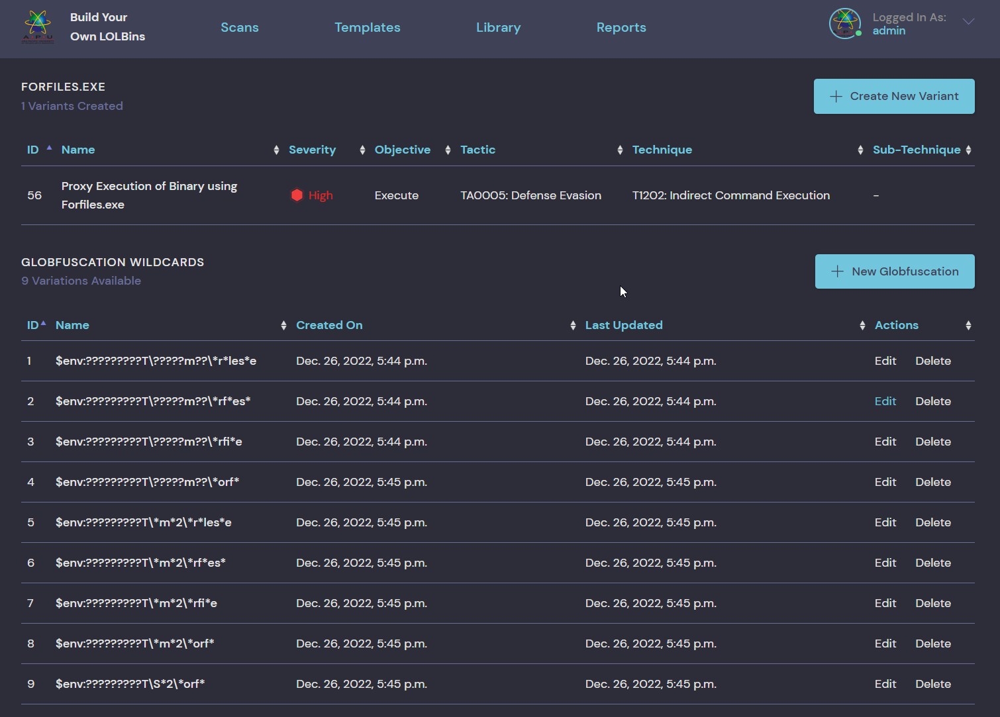

# Build-Your-Own-LOLBins


Build Your Own LOLBins (BYOL) is a threat simulation platform used for demonstrating the weaponization and detection
of Living-off-the-Land binaries native to the Windows Operating System. 

## Inspiration
This project is highly inspired by [Atomic Red Team](https://github.com/redcanaryco/atomic-red-team) and aims to expand beyond the scope of that by eliminating atomicity in individual test cases and providing flexibility in customization.

## Features
* LOLBins Chaining
* Self-Cleanup & Auto Destruct
* Commandline Obfuscation
  * Globufscation Wildcards
  * Character Substitution
* Customizable Payloads
* Custom Templates
* APT Procedural Examples
  * APT 37 Persistence Chain
  * Astaroth Infection Chain
  * Lazarus Infection Chain
* MITRE ATT&CK Framework Support
* Executive Report
* Exportable Telemetry JSON Data

| 📚 Documentation | 🦜 Releases |
| :--------------: | :----------: |
| [Link](./Documentation.MD) | [Link](https://github.com/WesleyWong420/Build-Your-Own-LOLBins/releases) |

## Installation
The technical requirements of this project are:
* Linux (Hosting BYOL)
* Windows 10 64-bit (Victim Virtual Machine)

**Run With Docker:**
```
git clone https://github.com/WesleyWong420/Build-Your-Own-LOLBins.git
cd Build-Your-Own-LOLBins/
docker-compose build
docker-compose up -d
curl http://localhost:8000
```
<br>

**NOTE**: BYOL uses Windows Remote Management (WinRM) to communicate with the remote host.
> To enable WinRM on the victim machine:
```
$ winrm quickconfig
$ winrm set winrm/config/service '@{AllowUnencrypted="true"}'
$ winrm set winrm/config/service/auth '@{Basic="true"}'
$ netsh advfirewall firewall add rule name="WinRM" dir=in localport=5985 protocol=TCP action=allow
$ Set-NetConnectionProfile -NetworkCategory Private
```

**NOTE**: BYOL requires admin privileges on the victim machine to enable Interactive Logon Session. 
> Only use Local Admin Account as the user credentials!

## Usage
**NOTE**: BYOL only deploys command-line based obfuscation to bypass string matching rules, such as those written in Sigma Project. All file-based Proof-of-Concept payloads, e.g. byol.dll, byol.exe, byol.js etc do not have defensive capabilities and will be flagged by AV vendors. 
> Although not mandatory, it is recommended to disable any AV solutions before performing a scan simulation!

[Tutorial](./Documentation.MD)

## Technique Coverage
| LOLBins | Variants | Objectives |
|:-----|:---------:|:-----------|
Certutil.exe | 5 | `Download` `ADS` `Encode` `Decode`
Msiexec.exe | 1 | `Execute`
Regsvr32.exe | 3 | `Execute` `AWL Bypass`
Cmstp.exe | 1 | `Execute`
Esentutl.exe | 2 | `ADS` `Credentials Dumping`
Rdrleakdiag.exe | 1 | `Credentials Dumping`
Makecab.exe | 1 | `Conceal`
Extract32.exe | 1 | `Decode`
Reg.exe | 3 | `AWL Bypass` `UAC Bypass`
Verclsid.exe | 1 | `Execute`
Regedit.exe | 1 | `Upload`
Mavinject.exe | 1 | `Execute`
Bitsadmin.exe | 1 | `Download`
Expand.exe | 2 | `Copy` `ADS`
Cscript.exe | 2 | `Execute`
Rundll32.exe | 7 | `Execute` `Download`
Mshta.exe | 3 | `Execute` `Download`
Wuauclt.exe | 1 | `Execute`
Eventvwr.exe | 1 | `UAC Bypass`
Pcalua.exe | 2 | `Execute`
Forfiles.exe | 1 | `Execute`
Wmic.exe | 3 | `Execute`
Cmd.exe | 1 | `Execute`
Powershell.exe | 4 | `Execute`
**TOTAL** | **49** | 

## APT Prodecural Examples
### **APT 37 -  STEEP#MAVERICK: New Covert Attack Campaign Targeting Military Contractors**
1. AMSI Bypass via Base64 Encoding
2. UAC Bypass via Eventwvr.exe Registry Tampering
3. Proxy Execution of Eventwvr.msc via Pcalua.exe
4. Download Encoded Payload `header.png` via Wmic.exe
5. Decode Final Payload via Certutil.exe

### **Astaroth - Fileless Malware Campaign Spreading Astaroth Malware**
1. Dropper downloads a remote VBScript to disk via Bitsadmin.exe
2. Malicious VBScript is copied to ADS and immediately wiped from disk
3. Cscript.exe executes the VBScript from ADS to download `mozsqlite3.dll`
4. `mozsqlite3.dll` containing Astaroth Malware is side-loaded via Rundll32.exe or Extexport.exe

### **Lazarus - LolZarus: Lazarus Group Incorporating Lolbins into Campaigns**
1. Expand.exe copies Wscript.exe laterally to masquerades as WindowsMediaPlayerVxEncdSrv.exe
2. Base64 encoded download cradle transfers malicious VBScript masquerading as `WMVxEncd.vbs`
3. Execution of VBScript is proxied via Forfiles.exe which implements Reflective DLL Injection to download `wuaueng.dll`
4. Wuauclt.exe is used as system binary proxy execution to load `wuaueng.dll`

## To-Do
- [X] Globfuscation
- [X] Export Report + JSON
- [X] WinRM Exceptions

## Screenshots
### **Home Page**


### **Scans**


### **Scan Details & Simulations**


### **Simulation & Technique Details**


### **Threat Templates**


### **Technique Library**


### **Variants Details**


### **Report Dashboard & Summary**


### **Admin Management**
